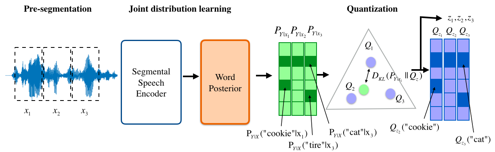

# Information Quantizer
<div align="left"></div>

This repository contains the code for the paper ``Self-supervised Semantic-driven Phoneme Discovery for Zero-resource Speech Recognition'' (more features available soon).
```
@inproceedings{wang-etal-2022-iq,
  author={Liming Wang and Siyuan Feng and Mark Hasegawa-Johnson and Chang D. Yoo},
  title={Self-supervised Semantic-driven Phoneme Discovery for Zero-resource Speech Recognition},
  booktitle={Annual Meeting of the Association for Computational Linguistics},
  year={2022}
}
```

### Dependencies
- [ZeroSpeech 2021 baseline system](https://github.com/zerospeech/zerospeech2021_baseline)
- [UnsupSeg](https://github.com/felixkreuk/UnsupSeg) 
- [BEER](https://github.com/beer-asr/beer)
- Other dependencies can be found in ```requirements.txt```

### How to run it?
0. Prepare datasets. Download the [LibriSpeech](https://www.openslr.org/12) dataset and manually cut out spoken word segments using information provided in resources/librispeech_word/librispeech_word.json. 
1. Modify the paths and variables in ```run.sh``` and configs/librispeech_word.conf 
2. Run ```bash run.sh```
